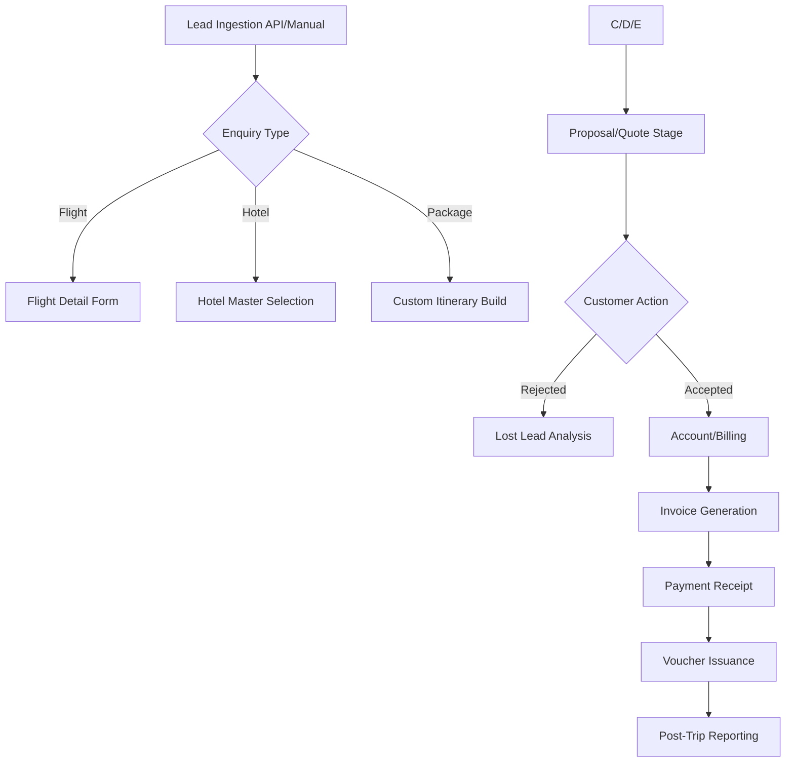

# TravoCRM: Comprehensive System Requirements & Architecture Document

## 1. Executive Summary
TravoCRM is a robust, travel-industry-specific Customer Relationship Management (CRM) platform designed to automate the lifecycle of travel bookings. It serves as a centralized hub for managing leads, customer communications, supplier coordination, and financial documentation (Invoices, Receipts, Vouchers).

## 2. System Architecture & Tech Stack
*   **Front-End Architecture**: Single Page Application (SPA).
*   **Routing**: Hash-based routing (e.g., `#/dashboard`, `#/add-lead`).
*   **Primary Integrations**:
    *   **Email**: Amazon SES (System-generated quotes/vouchers).
    *   **Messaging**: WhatsApp/SMS template integration for automated follow-ups.
    *   **External Lead Source**: Public REST endpoint (`leadapi.html`) for third-party ingestion.
*   **Data Format**: JSON-based RESTful API communication.

---

## 3. Core Module Inventory

### 3.1. Lead Management System
The most complex module, handling the top-of-funnel operations.
*   **Lead Ingestion**: Manual entry, bulk CSV import, or API-triggered (Facebook/Landing Pages).
*   **Dynamic Enquiry Types**: Selecting an enquiry type modifies the form schema:
    *   **Flight**: Captures Origin, Destination, Class, and Preferred Times.
    *   **Hotel**: Captures City, Star Rating, Check-in/out.
    *   **Visa**: Captures Country and Duration.
    *   **Package**: Merges multiple service types into a single quote request.
*   **Status Pipeline**: `Unqualified` → `New` → `Working` → `Proposal Sent` → `Negotiating` → `Booked` → `Lost`.

### 3.2. User & Access Control (RBAC)
*   **Admin**: Global configuration, API keys, and corporate settings.
*   **Operations Manager**: Team assignments, pipeline oversight, and advanced reporting.
*   **Operations Staff**: Individual lead handling and voucher issuance.
*   **Accountant**: Restricted access to financial ledgers without lead-edit permissions.

### 3.3. Financial & Document Engine
*   **Invoice Generation**: Automates GST/Tax calculations based on Base Currency (Default: INR).
*   **Voucher Management**: Separate templates for Hotel, Transport, Flight, and Sightseeing.
*   **Receipts**: Tracking payments against specific Invoices for Profit/Loss analysis.

---

## 4. Operational Workflow Map

---

## 5. Reporting & Analytics Taxonomy (50+ Reports)

| Category | Key Reports | Export Format |
| :--- | :--- | :--- |
| **Sales Performance** | Salesperson Wise, Lead Source Analysis, Conversion Rate. | PDF / Excel |
| **Financial Ledger** | Invoice List, Receipt List, Outstanding Balances. | PDF (Individual) |
| **Operations** | Hotel Voucher List, Transport Schedule, Flight Details. | PDF / Excel |
| **Audit & Quality** | User History, User Productivity, Error Log Analysis. | Web View Only |
| **Profitability** | Lead Wise Profit/Loss, Gross Margin by Travel Type. | Excel |

---

## 6. Data Dictionary (Inferred Schema)

### 6.1. Table: `leads`
| Field | Type | Description |
| :--- | :--- | :--- |
| `lead_id` | INT (PK) | Auto-increment identifier. |
| `first_name` | VARCHAR(100) | Mandatory; primary contact. |
| `lead_status_id` | INT (FK) | Reference to master status table. |
| `assigned_to` | INT (FK) | User ID of the owner. |

### 6.2. Table: `enquiry_details`
| Field | Type | Description |
| :--- | :--- | :--- |
| `enquiry_id` | INT (PK) | Link to primary Lead. |
| `pax_adults` | INT | Number of adult passengers (Mandatory). |
| `origin_code` | VARCHAR(3) | IATA code for flight segments. |
| `star_rating` | ENUM | 1*, 2*, 3*, 4*, 5* (Hotel specific). |

---

## 7. Business Logic & Constraints
*   **Validation Rules**: 
    *   "First Name" and "No. of Adults" are strictly mandatory for all lead types.
    *   Email address format must pass regex validation (prevents double `@` or missing top-level domains).
*   **Export Restrictions**: Bulk Excel export for Invoices is restricted to prevent massive data scraping by employees; PDF export is allowed per record.
*   **Currency Logic**: All internal calculations are processed in Base Currency, with conversion rates applied at the Quote stage for international clients.

## 8. UX/UI Characteristics
*   **Design Language**: Data-heavy dashboard using a standard administrative layout.
*   **Visual Feedback**:
    *   **Hot Leads**: Highlighted with specific status tags (Red/Orange).
    *   **Loading State**: Shimmer effects during large report generation.
*   **Auditability**: Every change in the lead lifecycle is logged in the "History/Timeline" tab for accountability.

---

## 9. Future Integration Capabilities
*   **GDS Integration**: Potential for direct flight booking (Amadeus/Sabre/TBO).
*   **payment Gateway**: Integration for direct client payment links from invoices.
*   **Mobile App**: Extension of the current SPA for field staff operations.
